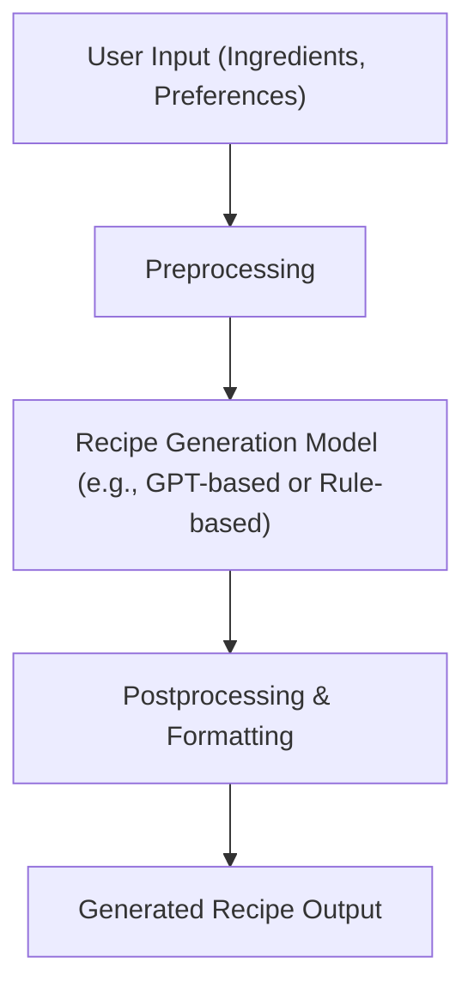

# Recipe Generator

This is a simple recipe generator project.

## Requirements

- Python 3.11.0
- See requirements.txt for dependencies

## Usage

Run the following command to start the recipe generator:

```bash
python recipe_generator.py
```

## Architecture & Model Workflow

Below is a diagram showing the workflow and model used in this project:



**Model Used:**  
The project uses a simple recipe generation model TheBloke/openchat-3.5-0106-GPTQ From HuggingFace 
- **Efficiency:** The model processes user input efficiently, generating recipes in real-time.
- **Extensibility:** You can easily swap the model for a more advanced one if needed.

